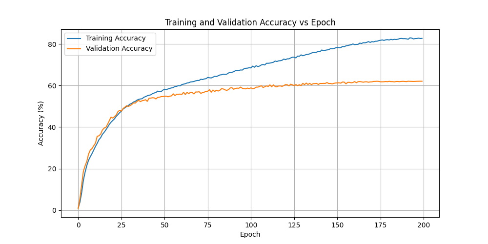
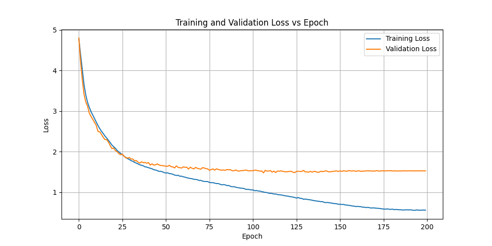

# Tiny-ViT-from-Scratch-on-CIFAR100
This project explores training a **Tiny Vision Transformer (ViT)** with **small number of parameters (1.5M)** **from scratch (no pretraining)** on the CIFAR-100 dataset, and achieving **over 60% test accuracy **with **10 min** training (on RTX 5090).

While CNN-based models (e.g., ResNet) can easily surpass this benchmark with limited data, ViTs typically rely heavily on large-scale pretraining (e.g., on ImageNet) to perform well.

The goal of this project is to **analyze and modify ViT architectures** to perform competitively on small-scale datasets like **CIFAR-100** **without any external data or pretrained weights**.


## Setup

1. **Install packages**

   ```
   $git clone https://github.com/Ruian7P/Tiny-ViT-from-Scratch-on-CIFAR100.git
   $cd Tiny-ViT-from-Scratch-on-CIFAR100
   $conda create -n TViT python=3.9
   $pip install -r requirements.txt
   ```

2. **Download CIFAR-100 Under folder `data`**

3. **Train ViT**

   ```
   $python main.py
   ```

   **with args**:  `image_size`, `patch_size`, `in_channels`, `embed_dim`, `num_heads`, `mlp_dim`, `num_layers`, `num_classes`, `dropout`, `batch_size`, `num_epochs`, `learning_rate`, `weight_decay`. 

   

   

## Results

| Model Parameters |      | Training Parameters  |         |
| ---------------- | ---- | -------------------- | ------- |
| image_size       | 32   | batch_size           | 256     |
| patch_size       | 4    | num_epochs           | 200     |
| in_channels      | 3    | learning_rate        | 1e-3    |
| embed_dim        | 192  | weight_decay         | 5e-4    |
| num_heads        | 8    |                      |         |
| mlp_dim          | 256  |                      |         |
| num_layers       | 6    | device               | 5090    |
| num_classes      | 100  | training time        | 10 min  |
| dropout          | 0.1  | trainable parameters | 1528228 |


- **Accuracy**

  

- **Loss**

  
